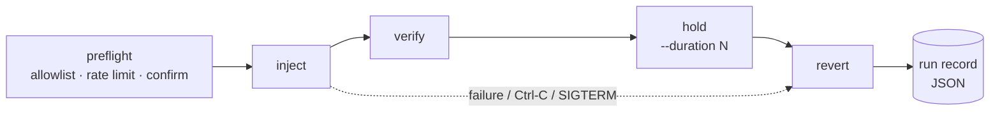

# kvmchaos

[](https://github.com/hervad/kvmchaos/actions/workflows/ci.yml)
[](https://github.com/hervad/kvmchaos/releases/latest)
[](pyproject.toml)
[](LICENSE)

**Agent-less chaos engineering for KVM/libvirt virtual machines.**

kvmchaos injects reversible faults into VMs from the hypervisor, using
libvirt, `tc netem` and cgroup v2. Nothing is installed inside the guest. Each
fault is injected, verified, held for a set duration and then reverted
automatically, and every run leaves a JSON audit record.

Use it to test how your services handle a paused database, a lossy network,
a full disk or a clock that jumped an hour, on the same KVM hosts they run on.

> [!WARNING]
> kvmchaos deliberately breaks VMs. Use it in labs and pre-production, set up
> an [allowlist](#safety-rails), and always try `--dry-run` first.

## Features

- **12 faults** across CPU, memory, network, disk and clock. See the [fault catalogue](#fault-catalogue).
- **Nothing to install in the guest.** Faults are applied at the hypervisor
  (tap devices, cgroups, libvirt domain APIs). The one exception is
  `clock.skew`, which needs the standard `qemu-guest-agent`.
- **Automatic revert.** Reverts run on normal exit, on Ctrl-C and on
  `SIGTERM`, and are idempotent.
- **Declarative experiments.** Multi-step TOML scenarios, with fan-out
  across several VMs and optional parallel execution.
- **Safety rails.** VM allowlists, rate limits, confirmation prompts,
  `--dry-run` and an `abort-all` emergency stop.
- **Observability.** Structured JSON events on stderr or in a JSONL file,
  webhook notifications, per-run JSON records and a self-contained HTML report.
- **Built for RHEL 9.** Ships as a self-contained RPM for air-gapped hosts.

## How it works

Every fault implements the same three-method interface, and the runner drives it
through a fixed lifecycle:



Faults act on the VM's own resources on the host:

| Layer | Mechanism |
|---|---|
| CPU / lifecycle | libvirt `suspend` / `destroy` / scheduler vCPU quota |
| Memory | virtio-balloon target via libvirt |
| Network | `tc netem` qdisc on the VM's host tap device (no `br_netfilter`) |
| Disk I/O | cgroup v2 `io.max` on the QEMU process |
| Disk space | fill file placed next to the VM image |
| Clock | libvirt `setTime`, backed by `qemu-guest-agent` |

## Install

### RPM (RHEL 9 / AlmaLinux 9 / Rocky 9)

Each [release](https://github.com/hervad/kvmchaos/releases/latest) includes a
self-contained x86_64 RPM (a PyInstaller binary with no Python runtime
needed), which suits air-gapped hosts:

```bash
sudo dnf install ./kvmchaos-*.el9.x86_64.rpm
kvmchaos --version
```

The RPM also installs bash completion.

### From source

Prerequisites: a Linux KVM host with `libvirtd` running, Python 3.11+ and
[uv](https://docs.astral.sh/uv/).

```bash
sudo dnf install libvirt-devel pkg-config iproute   # Fedora / RHEL
sudo usermod -aG libvirt $USER                       # then log out and back in

git clone https://github.com/hervad/kvmchaos.git && cd kvmchaos
uv sync
uv run kvmchaos doctor
```

`kvmchaos doctor` checks for `tc`, the cgroup v2 mount, `libvirt` group
membership, libvirtd reachability and write access to the runs directory.
It exits 0 when everything passes, 1 on warnings and 2 on failures.

> kvmchaos runs **on the hypervisor host itself**. Remote `qemu+ssh://` URIs
> are not supported. `net.*` and `disk.latency` need root (or
> `CAP_NET_ADMIN`); see [docs/sudo-setup.md](docs/sudo-setup.md) for a
> sudoers drop-in that keeps run records in your own home directory.

## Quick start

```bash
kvmchaos list-vms                 # running domains
kvmchaos list-faults              # available faults

# Preview a fault: prints the plan and changes nothing
kvmchaos inject vm.pause web1 --dry-run

# Freeze a VM for 10 seconds, then resume it
kvmchaos inject vm.pause web1 --yes --duration 10

# Add 200 ms of latency to a VM's NIC for 30 seconds
sudo kvmchaos inject net.latency web1 --yes --duration 30

# Review what happened
kvmchaos runs list
kvmchaos report --output report.html
```

## Fault catalogue

| Fault | Effect | Tuning flag (default) | Root |
|---|---|---|---|
| `vm.pause` | Freeze all vCPUs (libvirt suspend) | — | |
| `vm.kill` | Hard power-off; restart on revert | — | |
| `vm.freeze` | Cap vCPU time to 5% via scheduler quota | — | |
| `vm.starve` | Shrink guest RAM via virtio-balloon | — | |
| `net.latency` | Add 200 ms one-way delay | — | ✓ |
| `net.packet-loss` | Drop a percentage of packets | `--loss` % (10) | ✓ |
| `net.bandwidth` | Cap throughput | `--rate` kbps (1000) | ✓ |
| `net.corrupt` | Corrupt a percentage of packets | `--corrupt` % (1) | ✓ |
| `net.partition` | Drop 100% of traffic | — | ✓ |
| `disk.latency` | Throttle disk read/write bandwidth | `--bandwidth` MB/s (1) | ✓ |
| `disk.fill` | Consume host disk space next to the image | `--size` MiB (1024) | ✓¹ |
| `clock.skew` | Shift the guest clock (negative values go backward) | `--skew` s (3600) | |

¹ Only needs write access to the VM image directory. That usually means root,
because the default `/var/lib/libvirt/images` is owned by root.

Common `inject` flags: `--duration/-d N` (hold time, default 20 s),
`--dry-run/-n`, `--yes/-y`, `--force` (bypass safety rails) and
`--config PATH`.

## Experiments

Describe a multi-step scenario in TOML and run it with `kvmchaos run`:

```toml
name = "database-failover-drill"
description = "Partition the primary, then pause both replicas together."

[[step]]
fault = "net.partition"
vm = "db-primary"
duration = 60

[[step]]
fault = "vm.pause"
vms = ["db-replica-1", "db-replica-2"]   # fan-out: one fault per VM
parallel = true                          # run fan-out concurrently
duration = 15
continue_on_failure = true
```

```bash
kvmchaos run drill.toml --dry-run
sudo kvmchaos run drill.toml --yes --max-workers 4
```

Steps run in order. A failed step stops the experiment unless it sets
`continue_on_failure`. Consecutive `parallel = true` steps run as one
concurrent batch. On Ctrl-C, every worker stops its hold and reverts. See
[docs/examples/experiment.toml](docs/examples/experiment.toml) for the full
schema.

## Safety rails

kvmchaos reads the first config file it finds: the path given with `--config`,
then `$XDG_CONFIG_HOME/kvmchaos/config.toml`, then
`~/.config/kvmchaos/config.toml`, then `/etc/kvmchaos/config.toml`. Without a
config file, no safety rails are applied:

```toml
[allowlist]                 # only these VMs can be targeted
vms = ["server1", "server2"]
patterns = ["staging-*"]

[rate_limit]
injects_per_hour = 20
min_interval_between_destructive_seconds = 300
```

Targeting a VM that isn't on the allowlist exits with code 2; `--force`
overrides the check. Every inject asks for confirmation unless you pass
`--yes`.

**Emergency stop.** If kvmchaos was killed before it could revert (for example,
with `SIGKILL`), this command clears every active `netem` qdisc on the host:

```bash
sudo kvmchaos abort-all --yes
```

## Observability

| Output | How |
|---|---|
| Structured events on stderr (JSON; works with journald and `jq`) | Always on. `--verbose` adds DEBUG detail |
| JSONL event file | `kvmchaos --json-log events.jsonl inject …` |
| Webhook (Slack relay, alerting, CI) | `[notifier]` in config.toml |
| Per-run JSON audit record | `~/.local/state/kvmchaos/runs/` |
| HTML report | `kvmchaos report --since 2026-01-01 --fault net.latency` |

Events: `inject.start`, `inject.success`, `inject.error`, `revert.success`,
`revert.error`, `experiment.start`, `experiment.end`.

```toml
[notifier]
webhook_url = "https://hooks.example.com/kvmchaos"
auth_header = "Bearer <token>"      # optional
timeout_s = 3
events = ["inject.error", "revert.error"]   # omit for all events
```

`kvmchaos runs list` and `kvmchaos report` both accept `--since`, `--fault`,
`--outcome` and `--vm` filters. `kvmchaos runs show <id-prefix>` prints a
single run record.

## Recipes

[docs/recipes/](docs/recipes/README.md) contains worked scenarios, each with
prerequisites, commands and the expected outcome:

1. [Database failover](docs/recipes/01-database-failover.md)
2. [Disk-full alerting](docs/recipes/02-disk-full-alert.md)
3. [Flaky WAN link](docs/recipes/03-flaky-network.md)
4. [VM restart resilience](docs/recipes/04-vm-restart-resilience.md)
5. [Memory pressure](docs/recipes/05-memory-pressure.md)

## Platform support

| | RHEL 9 | RHEL 8 | Notes |
|---|---|---|---|
| `vm.*`, `net.*` | ✅ | ✅ | `net.*` uses `tc netem`; no nftables or `br_netfilter` needed |
| `disk.latency` | ✅ | ⚠️ | Requires cgroup v2. RHEL 8 needs `systemd.unified_cgroup_hierarchy=1` |
| `disk.fill` | ✅ | ✅ | Needs write access to the image directory |
| `clock.skew` | ✅ | ✅ | Needs `qemu-guest-agent` in the guest |

Primary target is RHEL 9. Development and lab validation are done on Fedora 43
with RHEL 9.x guests.

## Troubleshooting

Start with `kvmchaos doctor`, which catches most setup problems.

| Symptom | Cause | Fix |
|---|---|---|
| `Operation not permitted` on `net.*` / `disk.latency` | Needs root / `CAP_NET_ADMIN` | Run with `sudo` (see [sudo setup](docs/sudo-setup.md)) |
| `failed to connect to the hypervisor` | User not in `libvirt` group | `sudo usermod -aG libvirt $USER`, then log out and back in |
| `tc: command not found` | iproute2 missing | `sudo dnf install iproute` |
| `no network interface found for domain` | VM not running or has no vNIC | `virsh start <vm>` / `virsh domiflist <vm>` |
| `cgroups v2 hierarchy not found` | Host on cgroup v1 | Enable cgroup v2, or skip `disk.latency` |
| `clock.skew` fails | Guest agent missing | Install and start `qemu-guest-agent` in the guest |
| Run records end up in `/root` | `SUDO_USER` not resolved | Set `XDG_STATE_HOME` (see [sudo setup](docs/sudo-setup.md)) |
| `kvmchaos: command not found` under sudo | `$PATH` not preserved | Use the full path, e.g. `sudo ~/kvmchaos/.venv/bin/kvmchaos` |
| `netem` qdisc left behind after a crash | Revert never ran | `sudo kvmchaos abort-all --yes` |

## Development

```bash
uv sync
uv run pytest                                  # tests + coverage report
uv run ruff check && uv run ruff format --check
```

- Tests run against libvirt's built-in `test:///default` driver, which provides
  real `virDomain` objects and needs neither root nor QEMU. 450+ tests, about 96%
  coverage.
- Every fault is also lab-validated on a real KVM host before release.
- CI runs lint, format and tests on every push. Tagged releases build the
  sdist, wheel and RHEL 9 RPM.
- Runtime dependencies are deliberately limited to `libvirt-python` and `typer`.

Design notes and the roadmap are in [PLAN.md](PLAN.md) and
[docs/superpowers/specs/](docs/superpowers/specs/). Release history is in
[CHANGELOG.md](CHANGELOG.md).

## License

[MIT](LICENSE) © Vadym Herman
